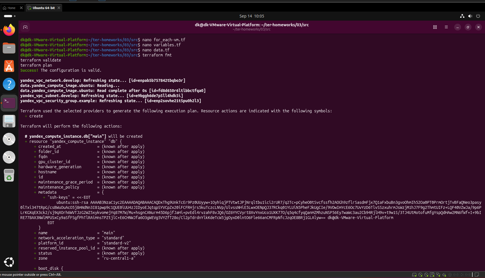
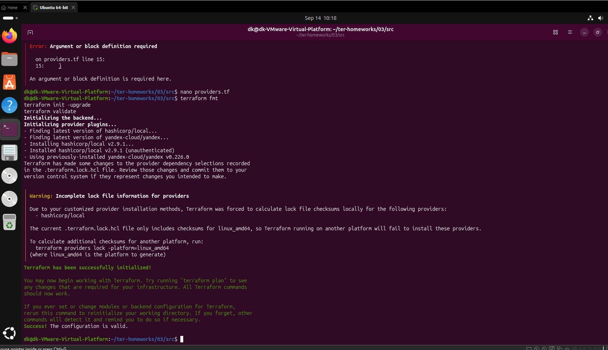
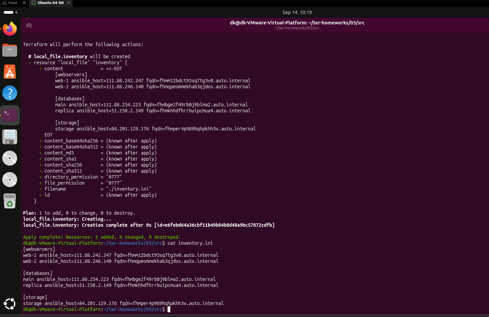
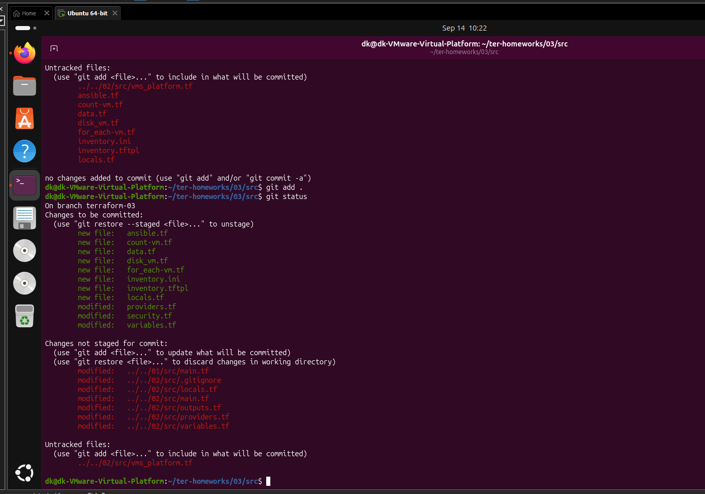
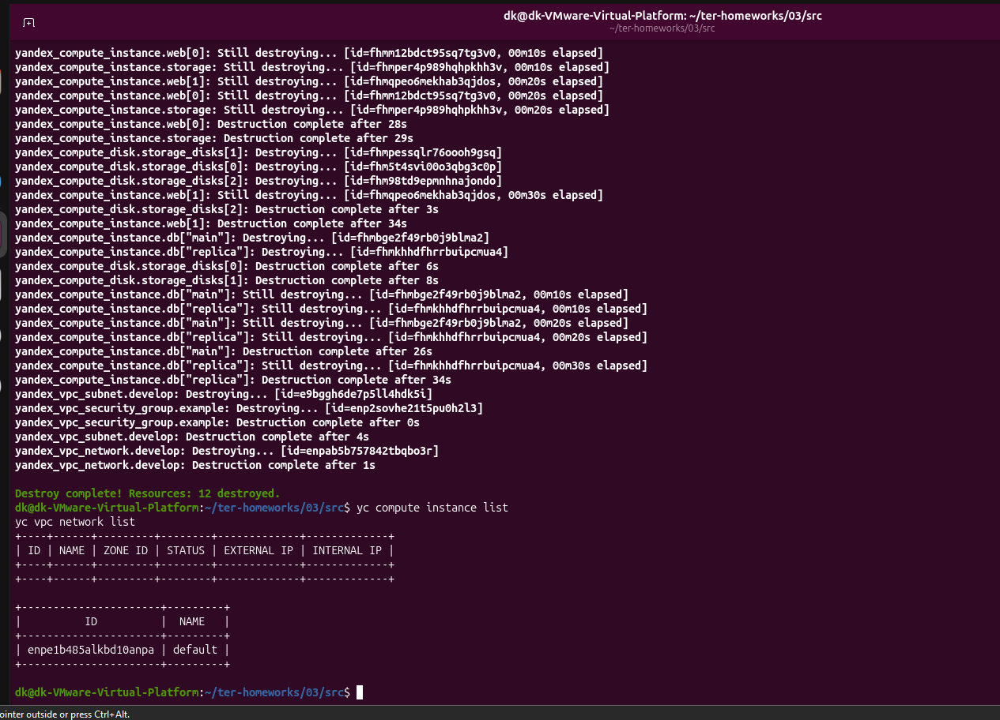

# Домашнее задание «Управляющие конструкции в коде Terraform»

Репозиторий содержит выполнение домашнего задания Netology по теме **«Управляющие конструкции в коде Terraform»**.

Используемая версия Terraform: `~> 1.12.0`.

## Что реализовано

### Задание 1

* Создана VPC-сеть `develop`.
* Создана подсеть `develop` в зоне `ru-central1-a`.
* Создана группа безопасности `example_dynamic`.
* Настроены входящие правила:

  * SSH — TCP/22;
  * HTTP — TCP/80;
  * HTTPS — TCP/443.
* Настроен исходящий трафик.

### Задание 2

Созданы четыре виртуальные машины.

#### Web-серверы через `count`

* `web-1`
* `web-2`

Для создания используется мета-аргумент `count`:

```hcl
count = 2
name  = "web-${count.index + 1}"
```

#### Базы данных через `for_each`

* `main`
* `replica`

Параметры ВМ передаются через общую переменную `each_vm` типа `list(object(...))`.

```hcl
for_each = {
  for vm in var.each_vm : vm.vm_name => vm
}
```

Web-серверы создаются после ВМ баз данных с помощью `depends_on`.

SSH-ключ считывается из файла:

```hcl
locals {
  ssh_public_key = file(pathexpand("~/.ssh/id_rsa.pub"))
}
```

Все ВМ являются прерываемыми:

```hcl
scheduling_policy {
  preemptible = true
}
```

### Задание 3

Созданы три дополнительных диска размером 1 ГБ:

* `storage-disk-1`
* `storage-disk-2`
* `storage-disk-3`

Диски создаются через `count`.

Также создана одиночная ВМ:

```text
storage
```

Дополнительные диски подключаются через динамический блок:

```hcl
dynamic "secondary_disk" {
  for_each = yandex_compute_disk.storage_disks

  content {
    disk_id = secondary_disk.value.id
  }
}
```

### Задание 4

Terraform формирует динамический Ansible inventory с помощью функции `templatefile()`.

Создаются три группы:

```ini
[webservers]
web-1
web-2

[databases]
main
replica

[storage]
storage
```

Для каждой виртуальной машины в inventory автоматически записываются:

* внешний IP-адрес;
* FQDN.

Пример:

```ini
web-1 ansible_host=<external_ip> fqdn=<fqdn>
```

## Структура файлов

```text
03/src/
├── ansible.tf
├── count-vm.tf
├── data.tf
├── disk_vm.tf
├── for_each-vm.tf
├── inventory.ini
├── inventory.tftpl
├── locals.tf
├── main.tf
├── providers.tf
├── security.tf
└── variables.tf
```

## Запуск проекта

Инициализация Terraform:

```bash
terraform init
```

Форматирование и проверка:

```bash
terraform fmt
terraform validate
```

Просмотр плана:

```bash
terraform plan
```

Создание инфраструктуры:

```bash
terraform apply -auto-approve
```

Просмотр сформированного Ansible inventory:

```bash
cat inventory.ini
```

Удаление ресурсов после выполнения задания:

```bash
terraform destroy -auto-approve
```

## Что было отработано

В рамках домашнего задания использованы:

* `count`;
* `for_each`;
* `depends_on`;
* `dynamic`;
* `locals`;
* функция `file()`;
* функция `templatefile()`;
* генерация Ansible inventory;
* работа с Yandex Cloud через Terraform.

## Итоговый коммит

[`b6f8481 — Terraform homework 03`](https://github.com/wwwsokol999-ui/terraform-homework-03/commit/b6f8481838c8f40e259cff8828dc3b87fc219b70)


## Скриншоты выполнения

### Задание 1. Группа безопасности













